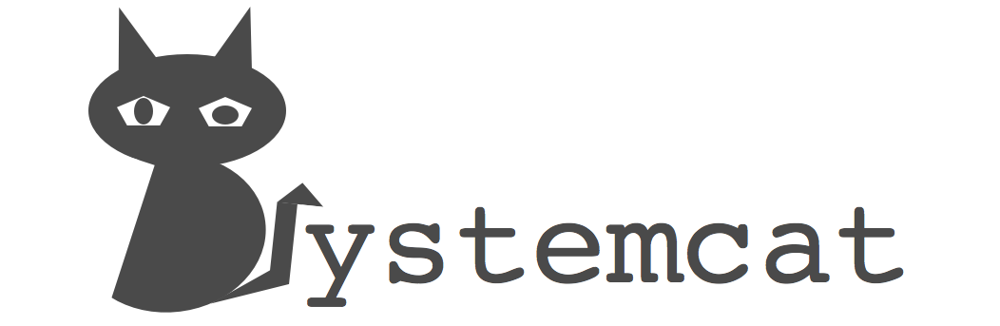

# Systemcat

Systemcat 致力于打造一个轻量级运维利器, 不断挖掘系统核心指标, 提供各种维度的分析和报告, 并提供系统的监控、问题发现和快捷处理等能力, 她将是一只非常聪明和敏锐的Cat :cat:

## PS:
由于在调研开源的轻量级 agent 的路上，让我不得不重新思考 `systemcat` 这个项目的必要性和可行性，或许，我应该先好好读读某一个开源项目的源码。比如 [netdata](http://netdata.firehol.org/), [telegraf](https://github.com/influxdata/telegraf) (来自 [TICK](https://www.influxdata.com/open-source/) 技术栈), [collectd](https://github.com/collectd/collectd/), [datadog](https://www.datadoghq.com/) ... 还有一些老牌的 c/s 监控平台, 如 zabbix 等. 国内的一些，比如 小米的 [open-falcon](https://github.com/open-falcon/agent) 等等. 国内一些效仿平台，而且收费的等就不列举了. 
